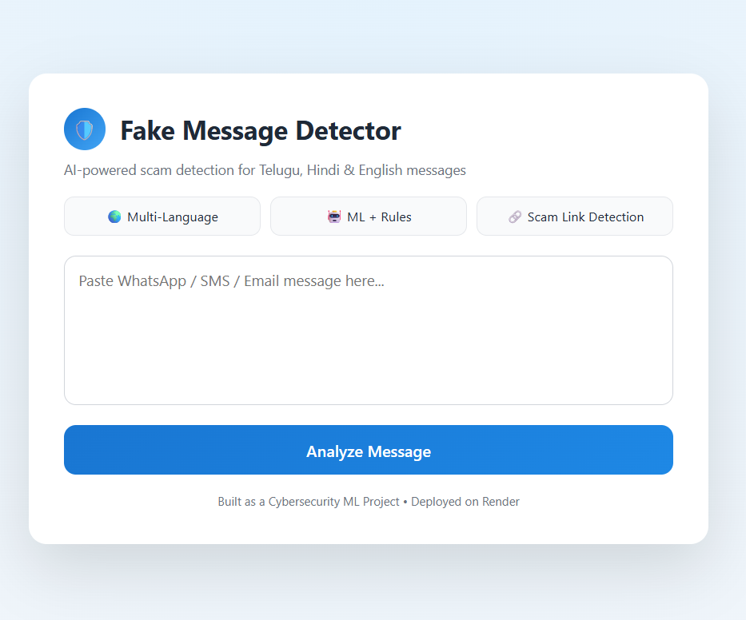

# 🛡️ Fake Message Detection System

**AI + Rules-based Web App to detect scam/fake messages in English, Hindi, and Telugu.**

🔗 **Live Demo:** https://multi-language-fake-message-detector-1.onrender.com

---

## 🚀 Project Features

✔ Detects suspicious links  
✔ Detects scam patterns in multiple languages  
✔ ML + Rule-based hybrid system  
✔ Beautiful interactive UI  
✔ Supports real-time classification

---

## 🛠️ Tech Stack

| Technology | Purpose |
|------------|---------|
| Python     | Backend logic & ML |
| Flask      | Web framework |
| Scikit-learn | ML classification |
| Regex      | Rule-based patterns |
| HTML/CSS/JS | Frontend UI |
| Render     | Deployment |

---

## 📸 Application Screenshots

### 🏠 Home Page


### ❌ Fake Message Detection


### ✅ Real Message Detection


---

## 🔥 Installation (Local)

1. Clone repo
```bash
git clone https://github.com/Sankar062003/fake-message-detector
cd fake-message-detector
